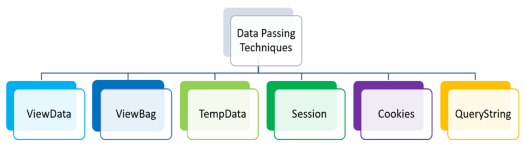
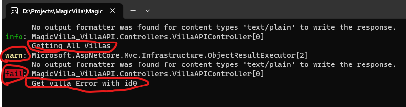
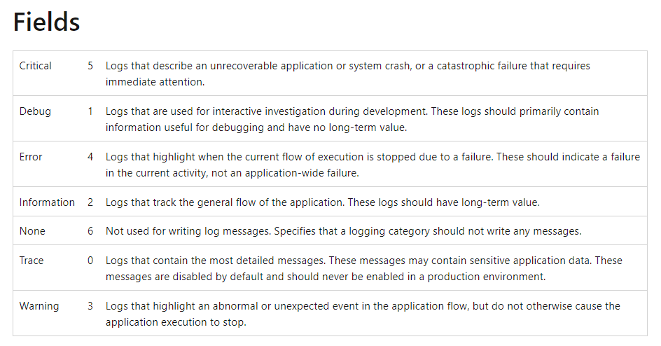
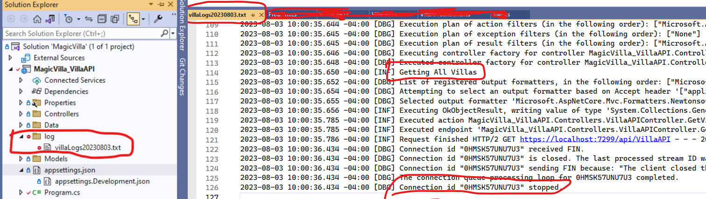

**View Components**
    - Pass data to views using several ways:
        - Strongly typed data: **ViewModel**
        - Weakly typed data: **ViewData**, **ViewBag**


SOLID Principles
Clean Architecture


## Fundamentals:
- Application Startup
- HTTP
- Middleware
- Routing
- Static Files
- Error Handling
- Globalization and localization
- Configuration
- Options
- Environments (dev, stage, prod)
- HttpContext
- Logging & Serilog
 🔧 File Providers
- Dependency Injection
- Hosting
- Session and state management
- Servers
- Request Features
- xUnit


## MVC
#### Overview of ASP.NET Core MVC
**Models**
 - Model Binding, Custom Model Binding
 - Model Validation
 - Formatting Response Data
 - 🔧 Custom Formatters

**Views**
 - Views Overview
 - Razor Views, Layout, Partial Views, View Components
 - Pass Data to View
 - Working with Forms
   - HTML Helpers
   - Tag Helpers
 - Authoring Tag Helpers
 - Injecting Services Into Views
 - View Components
 - 🔧 Creating a Custom View Engine

**Controllers**
 - Controllers, Actions, and IActionResult
 - 🔧 Routing to Controller Actions
 - Filters
 - Dependency Injection and Controllers
 - Testing Controller Logic
 - Areas
 - 🔧 Working with the Application Model

## Advanced
- Application parts
- Application model
- Areas
- Filters
- Razor SDK
- View components
- View compilation
- Display and Editor Templates
- Upload files
- Web SDK
- aspnet-codegenerator (Scaffolding)

## Web APIs
- Controller-Based APIs
- Minimal APIs
## Testing
 - Unit Testing [Advanced, Moq & Repository Pattern]
 - Integration Testing
 - Testing Controller Logic

## Servers
- Kestrel vs. HTTP.sys
- Hosting models
- Kestrel
- HTTP.sys

## Publishing and Deployment
## Guidance for Hosting Providers
## Security:
- Authentication
- Authorization
- Data protection
- HTTPS enforcement
- Safe storage of app secrets in development
- XSRF/CSRF prevention
- Cross Origin Resource Sharing (CORS)
- Cross-Site Scripting (XSS) attacks
https://aspnetcore.readthedocs.io/en/stable/security/index.html
https://learn.microsoft.com/en-us/aspnet/core/security/?view=aspnetcore-7.0

## Performance
## Globalization and localization

######################################################################################################
######################################################################################################
## Fundamentals:
- Application Startup
- HTTP

### Middleware:

##### 1. Configure method of Startup.cs
```c#
// set a basic middleware for all requests as did not mention a specific
app.Run(async (HttpContext context) =>
{
    await context.Response.WriteAsync("Welcome to middlewre vai");
});

// To start the application
app.Run();
```

**Middleware Chain/ Multiple Middleware:** run middleware one after other


```c#
// For Multiple Middleware
// Middleware 1
app.Use(async (HttpContext context, RequestDelegate next) =>
{
    await context.Response.WriteAsync("Middleware-1  ");
    await next(context);
});

// MIddleware 2
// writing Type of (HttpContext, RequestDelegate) are optional.
app.Use(async (context, next) =>
{
    await context.Response.WriteAsync("Middleware-2  ");
    await next(context); // next() called next middleware and without it middleware will not go to next one.
});

// Last Middleware
app.Run(async (HttpContext context) =>
{
    await context.Response.WriteAsync(" Last-Middleware");
});

app.Run();
```

##### 2. Custom Middleware Class:

Create a file: `CustomMiddleware/MyCustomMiddleware.cs `
```c#
namespace Fundamentals.CustomMiddleware
{
    public class MyCustomMiddleware : IMiddleware
    {
        public async Task InvokeAsync(HttpContext context, RequestDelegate next)
        {
            await context.Response.WriteAsync("Custom Middleware  Starts ");
            await next(context);
            await context.Response.WriteAsync(" Ends of Custom Middleware");
        }
    }
}
```
**Program.cs**
```c#
using Fundamentals.CustomMiddleware;

var builder = WebApplication.CreateBuilder(args);
// Register Custom Middleware
builder.Services.AddTransient<MyCustomMiddleware>();

// For Multiple Middleware
app.Use(async (HttpContext context, RequestDelegate next) =>
{
    await context.Response.WriteAsync("Middleware-1  ");
    await next(context);
});

// Custom Middleware
app.UseMiddleware<MyCustomMiddleware>();

// Last Middleware
app.Run(async (HttpContext context) =>
{
    await context.Response.WriteAsync(" Last-Middleware ");
});
app.Run();
```

**Output:** Middleware-1  Custom Middleware  Starts  Last-Middleware  Ends of Custom Middleware

##### 3. Custom Middleware Extensions:

`CustomMiddleware/MyCustomMiddleware.cs`
```c#
namespace Fundamentals.CustomMiddleware
{
    public class MyCustomMiddleware : IMiddleware
    {
        public async Task InvokeAsync(HttpContext context, RequestDelegate next)
        {
            await context.Response.WriteAsync("Custom Middleware  Starts ");
            await next(context);
            await context.Response.WriteAsync(" Ends of Custom Middleware");
        }
    }

    // Create Extension Method for Custom Middleware
    public static class CustomMiddlewareExtension
    {
        public static IApplicationBuilder UseMyCustomMiddleware (this IApplicationBuilder app)
        {
            return app.UseMiddleware<MyCustomMiddleware>();
        }
    }
}
```
**Program.cs**
```c#
// For Multiple Middleware
app.Use(async (HttpContext context, RequestDelegate next) =>
{
    await context.Response.WriteAsync("Middleware-1  ");
    await next(context);
});

// Use Extension of Custom Middleware
app.UseMyCustomMiddleware();

// Last Middleware
app.Run(async (HttpContext context) =>
{
    await context.Response.WriteAsync(" Last-Middleware ");
});
app.Run();
```

##### UseWhen():
- Url: https://localhost:7193/?anyname=hasan
- Only works if condition meets, get data from url
```c#
app.UseWhen(context => context.Request.Query.ContainsKey("anyname"), app =>
{
    app.Use(async (HttpContext context, RequestDelegate next) =>
    {
        await context.Response.WriteAsync(" Run Middleware when condition meets from Url!  ");
        await next(context);
    });
});
```


**Built-in middleware**

- **Authentication Middleware:** This provides authentication functionality for the application, such as handling login and logout functionality.
- **Static Files Middleware:** This serves static files, such as images, CSS, and JavaScript files, to the client.
- **Routing Middleware:** This maps incoming requests to the appropriate action in a controller.
- **Session Middleware:** This provides a way to store user-specific data between requests, such as user preferences or shopping cart contents.
- **Error/Exception Handling Middleware:** This provides a way to handle exceptions that occur during request processing and produce a friendly error response.
- **CORS (Cross-Origin Resource Sharing) Middleware:** This provides a way to handle cross-domain requests by allowing or denying specific origins.
- **GZIP Compression Middleware:** This compresses the response payload to reduce the amount of data transferred over the network, improving performance.
- **Cookie Policy**
- **MVC middleware:**
- **HTTPS Redirection Middleware:** This redirects HTTP requests to HTTPS to ensure that sensitive data is transmitted securely.


**Middleware Order**


```c#
app.UseExceptionHandler("/Error");
app.UseHsts();
app.UseHttpsRedirection();
app.UseStaticFiles();
app.UseRouting();
app.UseCors();
app.UseAuthentication();
app.UseAuthorization();
app.UseSession();
app.MapControllers();
//add your custom middlewares
app.Run();
```
  
## Routing:

#### Conventional Routing: Controllers + Actions Methods.
```c#
    // localhost/Home/Index
    public class HomeController : Controller
    {
        public IActionResult Index()
        {
            return View();
        }
    }
```
#### Another Way to write route on `Program.cs`**
```c#
// localhost/create-book
app.MapControllerRoute(
    name: "addnewbook", // Route Name to use
    pattern: "/createbook", // url
    defaults: new {controller="Book", action="Create"}
);
```
**Constraints (with Parameter) in Conventional Routing:**
```c#
using Microsoft.AspNetCore.Routing.Constraints;

app.MapControllerRoute(
        name: "default",
        pattern: "{controller}/{action}/{id?}", // localhost/Book/Details/12
        // pattern: "/book/details/{id?}", // Also write localhost/book/details/12
        new { Controller = "Book", action = "Details" }, 
        new { id = new IntRouteConstraint() }
    );

// BookController.cs
public IActionResult Details(int? id)  
{  
     return View();  
} 
```

#### Attribute Based Routing: 
```c#
   [Route("contact/create-contact")] // localhost/contact/create-contact
    public ActionResult Create()
    {
        return View();
    }
```

**Constraints (with Parameter) in Attribute Based route** 
```c#
[Route("book/display/{id:int?}")] // https://localhost:7228/book/display/20
public IActionResult Display(int? id)  
{  
     return View();  
} 
```

**Route Prefix:**

```c#
    [Route("contact")]  // when use `[Route("")]` in controller, we must have to use `[Route("")]` in actions also.
    public class ContactController : Controller
    {
        // https://localhost:7228/contact
        [Route("")]
        [Route("index")]
        [Route("/")]
        public ActionResult Index()
        {
            return View();
        }

       // https://localhost:7228/contact/new-contact
       [Route("new-contact")]
        public ActionResult Create()
        {
            return View();
        }
    }
```

#### Mixed Routing
We can use both Conventional Routing and Attribute Routing.

**Map(), MapGet(), MapPost(), MapPut() & MapDelete() Methods**
```c#
app.Map("/", ()=> "hello World!"); // accept all types of request
app.MapGet("/", () => "hello World!"); // accept Only GET request
app.MapPost("/", () => "hello World!"); // accept Only POST request
app.MapPut("/", () => "hello World!"); // accept Only PUT request
app.MapDelete("/", () => "hello World!"); // accept Only Delete request
```


**Compare terminal middleware with routing:**
```c#
// Approach 1: Terminal Middleware/ set condition.
app.Use(async (context, next) =>
{
    if (context.Request.Path == "/")
    {
        await context.Response.WriteAsync("Terminal Middleware.");
        return;
    }

    await next(context);
});

app.UseRouting();

// Approach 2: Routing.
app.MapGet("/Routing", () => "Routing.");
```
**Middleware example:**

**Route groups**


#### Static files in ASP.NET Core:

Static files are stored within the project's `wwwroot` directory. 
- wwwroot
   - images
     - MyImage.jpg

Use It:
``

```c#
// Program.cs
app.UseStaticFiles(); // add this middleware`
```

Error Handling
Globalization and localization
Configuration
Options
Environments (dev, stage, prod)
HttpContext
Logging & Serilog
 🔧 File Providers
- Dependency Injection
- Hosting
- Session and state management
- Servers
- Request Features
- xUnit


###################################################################
## MVC
#### Overview of ASP.NET Core MVC
**Models**
 - Model Binding, Custom Model Binding
 - Model Validation
 - Formatting Response Data
 - 🔧 Custom Formatters

**Views**
 - Views Overview
 - Razor Views, Layout, Partial Views, View Components
 - Pass Data to View
 - Working with Forms
   - HTML Helpers
   - Tag Helpers
 - Authoring Tag Helpers
 - Injecting Services Into Views
 - View Components
 - 🔧 Creating a Custom View Engine

#### Controllers
Controllers, Actions, and IActionResult
```c#
// Program.cs
var builder = WebApplication.CreateBuilder(args);
// Add MVC services to the container.
builder.Services.AddControllersWithViews();
```

**Status Code Results**
```c#
return BadRequest(); ← Http status code 400
return Unauthorized(); ← Http status code 401
return NotFound(); ← Http status code 404
```

**Action Method Returns:**
```c#
public IActionResult Index(){ return View() }
public ActionResult Index(){ return View() }

public JsonResult JsonResult()
{
    var name = "Hasan";
    return Json(new {data = name});
}

public ViewResult Index(){ return View() }
```


### Pass Data From Controller to View





 
**ViewData:**
```c#
// BookController.cs
public IActionResult Index()
{
    ViewData["MyInfo"] = "Nazmul Hasan Dalim";
    ViewData["AllCategories"] = _db.Categories.ToList();
    return View();
}

// index.cshtml
<h1>@ViewData["MyInfo"]</h1>
// @foreach (var category in (IEnumerable<Category>)ViewData["AllCategories"]) // same
@foreach (var category in ViewData["AllCategories"] as IList<Category>) //same
{
 <li>
    <td>@category.CategoryId</td>
    <td>@category.Name</td>
 </li>
}
```

**ViewBag:**
```c#
// BookController.cs
public IActionResult Index()
{
    ViewBag.MyInfo = "Nazmul Hasan";
    ViewBag.AllCategories = _db.Categories.ToList();
    return View();
}

// index.cshtml
<h1>@ViewBag.MyInfo</h1>
@foreach (var category in ViewBag.AllCategories)
{
    <li>@category.CategoryId</li>
    <li>@category.Name</li>
}
```

**TempData:**
- It is worked as a temporary data storage.
- It is mainly used for store data as a one time message.
- It is useful to transfer data between different action method in the different controller.
- Internally, temp data uses session variables. 

```c#
public IActionResult Index()
{
    TempData["name"] = "Dalim Vai";
    return View();
}

public IActionResult Contact()
{
    ViewBag.MyInfo = TempData["name"]; // return Dalim Vai
    return View();
}

public IActionResult About()
{
    //Now, TempData["name"] is null because already used it in Privacy() method
    ViewBag.MyInfo = TempData.; // no value
    return View();
}

// ContactUs.cshtml
<h2>Value- @ViewBag.MyInfo</h2> // Dalim vai

// About.cshtml
<h2>Value- @ViewBag.MyInfo</h2> // No value as already used in Contact()
```

**Store TempData for Next Uses(One time only)**
- To save all temp data, we use TempData["name"].keep()
- To save specific TempData, use 

```c#
public IActionResult Index()
{
    TempData["name"] = "Dalim Vai";
    TempData["AllCategories"] = _db.Categories.ToList();
    return View();
}

public IActionResult Privacy()
{
    // ViewBag.MyInfo = TempData["name"];
    // TempData.Keep("name"); // Keep data for next one time uses

    // Both Line also can be write using Peek(), it save data and also store data for next call
    ViewBag.MyInfo = TempData.Peek("name");
    return View();
}

// TempData can be used from Another Controller
public class CategoryController : Controller
    {
        public IActionResult Index()
        {
            ViewBag.MyInfo = TempData["name"]; // Dalim Vai
            return View();
        }
    }


// Index.cshtml
<table>
    @foreach (var category in TempData["AllCategories"] as IList<Category>)
       {
         <tr>
            <td>@category.CategoryId</td>
            <td>@category.Name</td>
         </tr>
        }
</table>
```

**Display messege after storing data**
```c#
[HttpPost]
[ValidateAntiForgeryToken]
public IActionResult Create(Category category)
{
    if (ModelState.IsValid)
    {
        _db.Categories.Add(category);
        _db.SaveChanges();

        TempData["messege"] = "Data stored successfully!";
        return RedirectToAction("Index");
    }
    return View(category);
}

// Index.cshtml
@if (TempData["messege"] !=null)
{
    <div class="alert alert-success">
        @TempData["messege"]
    </div>
}
```


**Session:**
- Install `Microsoft.AspNetCore.Session` (for NTier select only project name and data access)

Configure session state to `Program.cs`

```c#
builder.Services.AddSingleton<IHttpContextAccessor, HttpContextAccessor> ();
builder.Services.AddDistributedMemoryCache();

builder.Services.AddSession(options =>
{
    options.IdleTimeout = TimeSpan.FromSeconds(120);
    options.Cookie.HttpOnly = true;
    options.Cookie.IsEssential = true;
});


app.UseSession(); // after app.UseRouting() and before app.MapControllerRoute()
```

HomeController.cs

```c#
public class HomeController : Controller
{
    private readonly IHttpContextAccessor context; // for session
    private readonly TestDbContext _db; // for db
    public HomeController(TestDbContext db, IHttpContextAccessor httpContextAccessor)
    {
        _db = db;
        context = httpContextAccessor;
    }
    public IActionResult Index()
    {
        context.HttpContext.Session.SetString("Name", "The Doctor");
        context.HttpContext.Session.SetInt32("Age", 73);
        return View();
    }
}
```

Index.cshtml

**We can use session from anywherein the apps**

```c#
@inject IHttpContextAccessor context
Name: @context.HttpContext.Session.GetString("Name")
Age: @context.HttpContext.Session.GetInt32("Age")
```


 
 - 🔧 Routing to Controller Actions
 - Filters
 - Dependency Injection and Controllers
 - Testing Controller Logic
 - Areas
 - 🔧 Working with the Application Model


## Logging & Serilog
It helps us in the investigation of the essence of problems. We can pass messege from every function so that we can know quickly any error or success.
So, there are two important building blocks for implementing logging in a .NET Core based application:

- Logging API
- Logging Providers

Program.cs
```c#
var builder = WebApplication.CreateBuilder(args);
// Add Logger
builder.Logging.ClearProviders();
builder.Logging.AddConsole();
```
**Or/ Alternatively, the preceding logging code can be written as follows:**
```c#
var builder = WebApplication.CreateBuilder();
builder.Host.ConfigureLogging(logging =>
{
    logging.ClearProviders();
    logging.AddConsole();
});
```
**Create logs in Controller**
```c#
private readonly ILogger<VillaAPIController> _logger;
public VillaAPIController(ILogger<VillaAPIController> logger)
{
    _logger = logger;
}

public ActionResult<IEnumerable<VillaDto>> GetVillas()
{
    _logger.LogInformation("Getting All Villas");
    return Ok(VillaStore.villaLists);       
}

public ActionResult<VillaDto> GetVilla(int id)
{
    if (id == 0)
    {
        _logger.LogError("Get villa Error with id" + id);
        return BadRequest();
    }
    
    return Ok("success");
}
```
**We will see these messege from console**



**Configure logging:**
appsettings.Development.json file is generated by
```c#
{
  "Logging": {
    "LogLevel": {
      "Default": "Information",
      "Microsoft.AspNetCore": "Warning"
    }
  }
}
```


### Serilog:

It uses for logging in production level. we will create a log/loggingFile.txt file for getting all logging messges

**Install Packages**

```c#
Serilog.AspNetCore
Serilog.Sinks.File
```
**Add few lines to** `program.cs`
```c#
using Serilog;

var builder = WebApplication.CreateBuilder(args);
Log.Logger = new LoggerConfiguration().MinimumLevel.Debug()
                                      .WriteTo.File("log/villaLogs.txt", rollingInterval:RollingInterval.Day).CreateLogger();
builder.Host.UseSerilog();
```

`log/loggingFile.txt`




