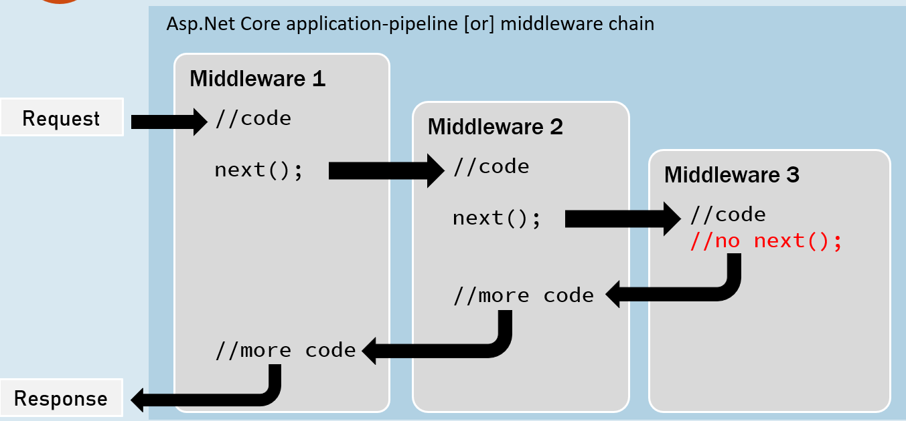

**View Components**
    - Pass data to views using several ways:
        - Strongly typed data: **ViewModel**
        - Weakly typed data: **ViewData**, **ViewBag**


SOLID Principles
Clean Architecture


## Fundamentals:
- Application Startup
- HTTP
- Middleware
- Routing
- Static Files
- Error Handling
- Globalization and localization
- Configuration
- Options
- Environments (dev, stage, prod)
- HttpContext
- Logging & Serilog
 🔧 File Providers
- Dependency Injection
- Hosting
- Session and state management
- Servers
- Request Features
- xUnit


## MVC
#### Overview of ASP.NET Core MVC
**Models**
 - Model Binding, Custom Model Binding
 - Model Validation
 - Formatting Response Data
 - 🔧 Custom Formatters

**Views**
 - Views Overview
 - Razor Views, Layout, Partial Views, View Components
 - Pass Data to View
 - Working with Forms
   - HTML Helpers
   - Tag Helpers
 - Authoring Tag Helpers
 - Injecting Services Into Views
 - View Components
 - 🔧 Creating a Custom View Engine

**Controllers**
 - Controllers, Actions, and IActionResult
 - 🔧 Routing to Controller Actions
 - Filters
 - Dependency Injection and Controllers
 - Testing Controller Logic
 - Areas
 - 🔧 Working with the Application Model

## Advanced
- Application parts
- Application model
- Areas
- Filters
- Razor SDK
- View components
- View compilation
- Display and Editor Templates
- Upload files
- Web SDK
- aspnet-codegenerator (Scaffolding)

## Web APIs
- Controller-Based APIs
- Minimal APIs
## Testing
 - Unit Testing [Advanced, Moq & Repository Pattern]
 - Integration Testing
 - Testing Controller Logic

## Servers
- Kestrel vs. HTTP.sys
- Hosting models
- Kestrel
- HTTP.sys

## Publishing and Deployment
## Guidance for Hosting Providers
## Security:
- Authentication
- Authorization
- Data protection
- HTTPS enforcement
- Safe storage of app secrets in development
- XSRF/CSRF prevention
- Cross Origin Resource Sharing (CORS)
- Cross-Site Scripting (XSS) attacks
https://aspnetcore.readthedocs.io/en/stable/security/index.html
https://learn.microsoft.com/en-us/aspnet/core/security/?view=aspnetcore-7.0

## Performance
## Globalization and localization

######################################################################################################
######################################################################################################
## Fundamentals:
- Application Startup
- HTTP

### Middleware:

##### 1. Configure method of Startup.cs
```c#
// set a basic middleware for all requests as did not mention a specific
app.Run(async (HttpContext context) =>
{
    await context.Response.WriteAsync("Welcome to middlewre vai");
});

// To start the application
app.Run();
```

**Middleware Chain/ Multiple Middleware:** run middleware one after other



```c#
// For Multiple Middleware
// Middleware 1
app.Use(async (HttpContext context, RequestDelegate next) =>
{
    await context.Response.WriteAsync("Middleware-1  ");
    await next(context);
});

// MIddleware 2
// writing Type of (HttpContext, RequestDelegate) are optional.
app.Use(async (context, next) =>
{
    await context.Response.WriteAsync("Middleware-2  ");
    await next(context); // next() called next middleware and without it middleware will not go to next one.
});

// Last Middleware
app.Run(async (HttpContext context) =>
{
    await context.Response.WriteAsync(" Last-Middleware");
});

app.Run();
```

##### 2. Custom Middleware Class:

Create a file: `CustomMiddleware/MyCustomMiddleware.cs `
```c#
namespace Fundamentals.CustomMiddleware
{
    public class MyCustomMiddleware : IMiddleware
    {
        public async Task InvokeAsync(HttpContext context, RequestDelegate next)
        {
            await context.Response.WriteAsync("Custom Middleware  Starts ");
            await next(context);
            await context.Response.WriteAsync(" Ends of Custom Middleware");
        }
    }
}
```
**Program.cs**
```c#
using Fundamentals.CustomMiddleware;

var builder = WebApplication.CreateBuilder(args);
// Register Custom Middleware
builder.Services.AddTransient<MyCustomMiddleware>();

// For Multiple Middleware
app.Use(async (HttpContext context, RequestDelegate next) =>
{
    await context.Response.WriteAsync("Middleware-1  ");
    await next(context);
});

// Custom Middleware
app.UseMiddleware<MyCustomMiddleware>();

// Last Middleware
app.Run(async (HttpContext context) =>
{
    await context.Response.WriteAsync(" Last-Middleware ");
});
app.Run();
```

**Output:** Middleware-1  Custom Middleware  Starts  Last-Middleware  Ends of Custom Middleware

##### 3. Custom Middleware Extensions:

`CustomMiddleware/MyCustomMiddleware.cs`
```c#
namespace Fundamentals.CustomMiddleware
{
    public class MyCustomMiddleware : IMiddleware
    {
        public async Task InvokeAsync(HttpContext context, RequestDelegate next)
        {
            await context.Response.WriteAsync("Custom Middleware  Starts ");
            await next(context);
            await context.Response.WriteAsync(" Ends of Custom Middleware");
        }
    }

    // Create Extension Method for Custom Middleware
    public static class CustomMiddlewareExtension
    {
        public static IApplicationBuilder UseMyCustomMiddleware (this IApplicationBuilder app)
        {
            return app.UseMiddleware<MyCustomMiddleware>();
        }
    }
}
```
**Program.cs**
```c#
// For Multiple Middleware
app.Use(async (HttpContext context, RequestDelegate next) =>
{
    await context.Response.WriteAsync("Middleware-1  ");
    await next(context);
});

// Use Extension of Custom Middleware
app.UseMyCustomMiddleware();

// Last Middleware
app.Run(async (HttpContext context) =>
{
    await context.Response.WriteAsync(" Last-Middleware ");
});
app.Run();
```

##### UseWhen():
- Url: https://localhost:7193/?anyname=hasan
- Only works if condition meets, get data from url
```c#
app.UseWhen(context => context.Request.Query.ContainsKey("anyname"), app =>
{
    app.Use(async (HttpContext context, RequestDelegate next) =>
    {
        await context.Response.WriteAsync(" Run Middleware when condition meets from Url!  ");
        await next(context);
    });
});
```


**Built-in middleware**

- **Authentication Middleware:** This provides authentication functionality for the application, such as handling login and logout functionality.
- **Static Files Middleware:** This serves static files, such as images, CSS, and JavaScript files, to the client.
- **Routing Middleware:** This maps incoming requests to the appropriate action in a controller.
- **Session Middleware:** This provides a way to store user-specific data between requests, such as user preferences or shopping cart contents.
- **Error/Exception Handling Middleware:** This provides a way to handle exceptions that occur during request processing and produce a friendly error response.
- **CORS (Cross-Origin Resource Sharing) Middleware:** This provides a way to handle cross-domain requests by allowing or denying specific origins.
- **GZIP Compression Middleware:** This compresses the response payload to reduce the amount of data transferred over the network, improving performance.
- **Cookie Policy**
- **MVC middleware:**
- **HTTPS Redirection Middleware:** This redirects HTTP requests to HTTPS to ensure that sensitive data is transmitted securely.


**Middleware Order**


```c#
app.UseExceptionHandler("/Error");
app.UseHsts();
app.UseHttpsRedirection();
app.UseStaticFiles();
app.UseRouting();
app.UseCors();
app.UseAuthentication();
app.UseAuthorization();
app.UseSession();
app.MapControllers();
//add your custom middlewares
app.Run();
```
  
### Routing:
###### Conventional Routing: Controllers + Actions Methods.

Url: `localhost/Home/Index`
```c#
    public class HomeController : Controller
    {
        public IActionResult Index()
        {
            return View();
        }
    }
```
****Another Way to write route on `Program.cs`**
```c#
// localhost/create-book
app.MapControllerRoute(
    name: "addnewbook", // Route Name to use
    pattern: "/createbook", // url
    defaults: new {controller="Book", action="Create"}
);

```


#### Attribute-based routing: 
**One Way:**
```c#
    public class ContactController : Controller
    {
        // localhost/create-contact
        // localhost/contact/create-contact
       [Route("create-contact")]
       [Route("contact/create-contact")] // two url's will work or we can only use one
        public ActionResult Create()
        {
            return View();
        }
    }
```

**Another Way:**

```c#
    [Route("contact")]  // when use `[Route("")]` in controller, we must have to use `[Route("")]` in actions also.
    public class ContactController : Controller
    {
        // https://localhost:7228/contact
        [Route("")]
        [Route("Index")]
        [Route("/")]
        public ActionResult Index()
        {
            return View();
        }

       // https://localhost:7228/contact/new-contact
       [Route("new-contact")]
        public ActionResult Create()
        {
            return View();
        }
    }
```

#### Attribute Routing Tokens/ Dynamic
```c#
    [Route("[controller]/[action]")] // whatever controller and action we write on URL, it will run these actions.
    public class ContactController : Controller
    {
        // https://localhost:7228/contact
        public ActionResult Index()
        {
            return View();
        }

       // https://localhost:7228/contact/new-contact
        public ActionResult Create()
        {
            return View();
        }
    }
```

#### Mixed Routing

**We can use both Conventional Routing and Attribute Routing**
```c#
    [Route("[controller]/[action]")]
    public class BookController : Controller
    {
        // https://localhost:7228/Book/Index
        // https://localhost:7228/Book
        [Route("")]
        [Route("Index")]
        [Route("/")]
        public ActionResult Index()
        {
            return View();
        }
    }
```
**Map(), MapGet(), MapPost(), MapPut() & MapDelete() Methods**
```c#
app.Map("/", ()=> "hello World!"); // accept all types of request
app.MapGet("/", () => "hello World!"); // accept Only GET request
app.MapPost("/", () => "hello World!"); // accept Only POST request
app.MapPut("/", () => "hello World!"); // accept Only PUT request
app.MapDelete("/", () => "hello World!"); // accept Only Delete request
```
#### Route Constraints:
Route Constraints are used to filter the type of passed value to an action. For example, if you expect an integer type id, then you have to filter it using datatype, {id:int}

`:int, :bool, :string, :datetime, :decimal, :guid`

**There are two ways, you can add Constraint to a URL Parameter.**
- Inline with the URL Parameter
- Using the Constraint argument of the MapRoute method.


Static Files
Error Handling
Globalization and localization
Configuration
Options
Environments (dev, stage, prod)
HttpContext
Logging & Serilog
 🔧 File Providers
- Dependency Injection
- Hosting
- Session and state management
- Servers
- Request Features
- xUnit


