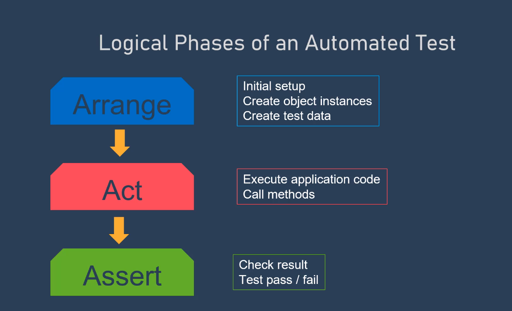

## Test types
- Unit tests
- Integration tests
- Load tests
- User Interface Test

### Unit tests:
A unit test is a test that exercises individual software components or methods, also known as a "unit of work."
  - xUnit (xUnit is a free, open-source, community-focused unit testing tool for .NET)

